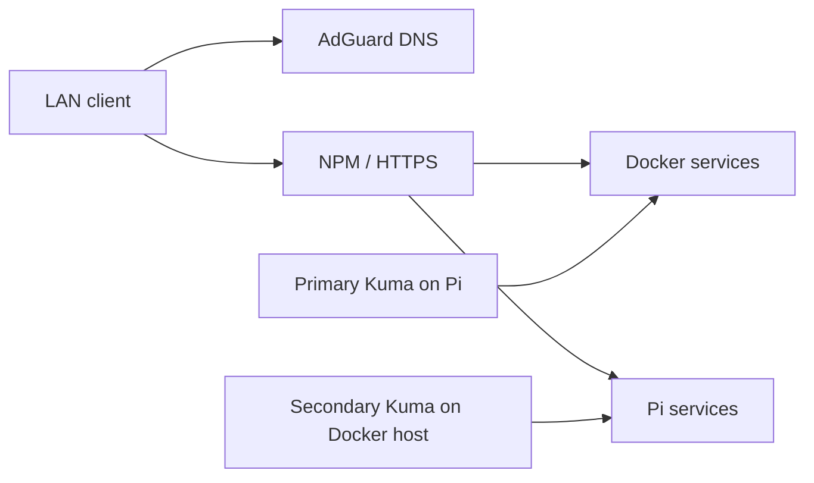

# Networking overview

The network uses a UniFi Cloud Gateway Max for routing, firewall policies, and VLAN management, with a Cisco Catalyst switch operating at Layer 2. This public document retains private addressing but uses example service domains and omits credentials and public IP addresses.

## VLAN layout

| VLAN | Purpose | Subnet |
|---|---|---|
| 1 | UniFi infrastructure | `10.10.1.0/24` |
| 20 | Servers | `10.10.20.0/24` |
| 30 | Trusted clients | `10.10.30.0/24` |
| 40 | IoT devices | `10.10.40.0/24` |
| 50 | Guest network | `10.10.50.0/24` |
| 60 | Work devices | `192.168.1.0/24` |

The work network uses a different range to avoid a corporate VPN overlap. Wireless networks map to their respective VLANs; actual SSIDs are omitted. The separately documented WireGuard tunnel uses `10.10.99.0/24`.

## DNS and proxy paths

AdGuard Home runs as the primary resolver at `10.10.20.6` and on a separate Pi at `10.10.20.8`. A secondary DNS address does not guarantee that clients query only the primary until it fails; client resolver behavior varies.

NPM on `10.10.20.5` forwards service hostnames to LAN backends and handles TLS. Local DNS can resolve these hostnames to the proxy's private address, letting clients use HTTPS without traversing the public route. Real service domains are represented by `example.com` in this repository.

## External access

The existing documented design forwards HTTP/HTTPS through Cloudflare and the gateway to NPM, with gateway rules intended to restrict proxied inbound traffic to Cloudflare ranges. Other explicitly allowed game traffic is separate. Internal management access also uses WireGuard.

This distinguishes intentionally published application routes from private VPN access; not all remote access follows one path. Current WAN firewall policy and external reachability were not re-audited during the September documentation update. Cloudflare proxying alone is not a guarantee against origin exposure.

## Monitoring boundaries

Use separate host, service, domain, and DNS-query checks to identify failure layers. A LAN HTTPS check exercises local DNS/NPM/TLS and the backend, but does not necessarily test public DNS, Cloudflare, WAN forwarding, or outside reachability.

Both Kuma instances still depend on shared home infrastructure and Internet access for Telegram delivery. See [Uptime Kuma](../Containers/UptimeKuma.md).

## Docker network follow-up

The media stack's live Docker network requires an addressing correction. The public [Compose template](../Containers/MediaBackend.yaml) uses private `172.30.0.0/24` addressing instead. It is not a statement that the running network has already been migrated. Check overlap and dependencies before making that separate change.
